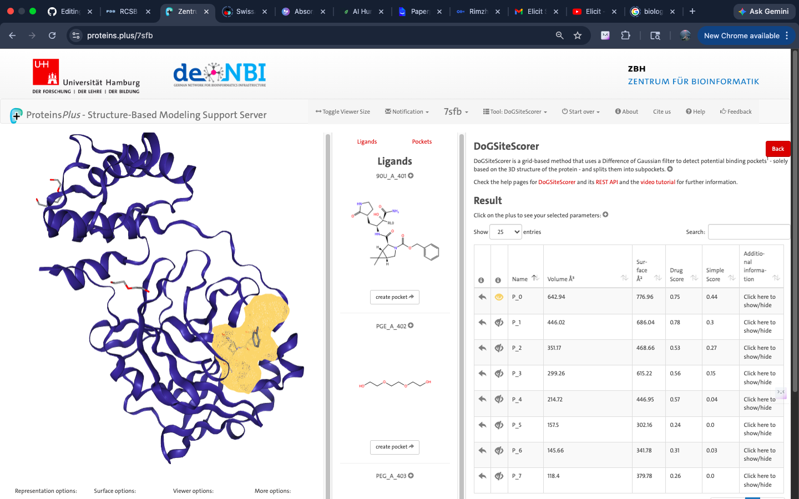
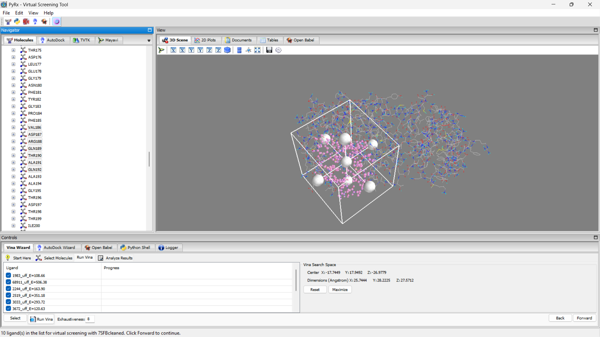
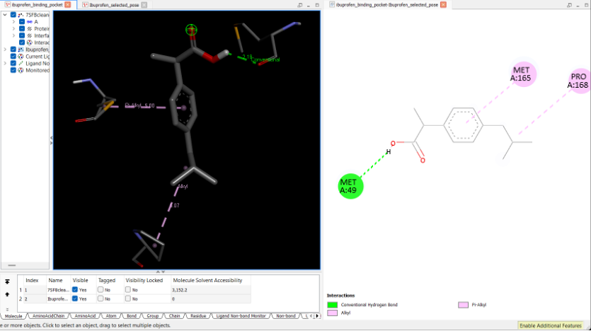
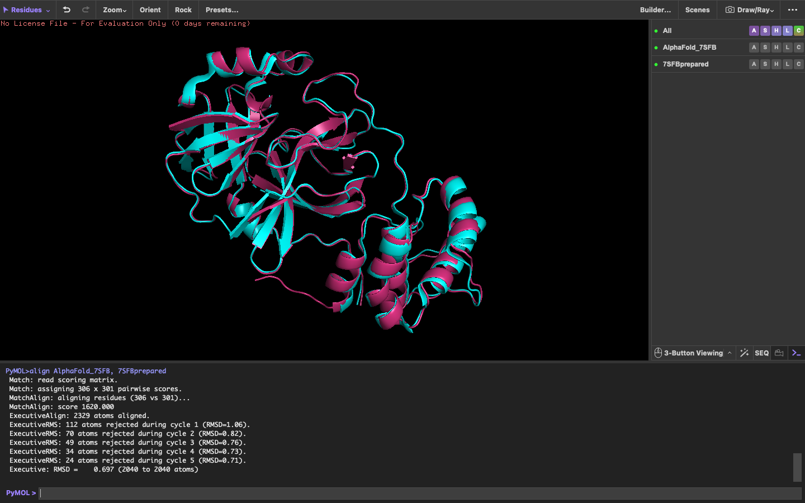

# Molecular Docking and ADMET Analysis of Selected Compounds Against SARS-CoV-2 Main Protease (7SFB)

## Overview

This repository contains a beginner-level Computer-Aided Drug Design (CADD) capstone project focused on the computational analysis of the SARS-CoV-2 Main Protease (Mpro) structure (PDB ID: 7SFB). The project was designed to explore fundamental drug discovery workflows using a combination of structure-based bioinformatics and molecular modeling approaches.

The study included protein preparation, binding site prediction, drug-likeness screening, ADMET prediction, AlphaFold3 structure comparison, molecular docking, and protein–ligand interaction analysis using a selected library of therapeutic compounds.
 
This project was completed as part of a structured virtual research training program and aims to demonstrate practical understanding of essential computational biology and CADD workflows in a reproducible and well-documented format.

---

## Objectives

- To prepare and analyze the SARS-CoV-2 Main Protease (7SFB) structure for structure-based computational studies.

- To evaluate the drug-likeness and ADMET properties of selected therapeutic compounds using in silico screening approaches.

- To identify and examine potential binding pockets within the target protein structure.

- To compare experimentally derived and AlphaFold3-predicted protein structures for structural assessment.

- To perform molecular docking studies in order to investigate possible protein–ligand interactions between 7SFB and the selected compounds.

- To visualize and interpret docking interactions using molecular visualization tools.

---

## Workflow

1. Retrieval of the 7SFB protein structure from the Protein Data Bank (PDB)

2. Protein cleaning and preparation for computational analysis

3. Ligand collection and structure preparation from public chemical databases

4. Drug-likeness screening of selected compounds

5. Binding site prediction using the prepared protein structure

6. ADMET property prediction and evaluation

7. AlphaFold3 structure prediction and comparison with the experimental structure

8. Molecular docking of selected ligands against the target protein using PyRx

9. Visualization and interpretation of protein–ligand interactions using Discovery Studio Visualizer

---

## Tools and Software Used

| Tool / Database | Purpose |
|------------------|---------|
| Protein Data Bank (PDB) | Retrieval of the SARS-CoV-2 Main Protease structure (7SFB) |
| PyMOL | Visualization of binding site residues and structural inspection of predicted docking regions |
| UCSF Chimera | Protein visualization, cleaning, and preparation
| PubChem | Collection of ligand structures and chemical information |
| PyRx | Molecular docking and ligand preparation |
| Discovery Studio Visualizer | Visualization and analysis of protein–ligand interactions |
| SwissADME | Drug-likeness screening and physicochemical property evaluation |
| ADMETlab | ADMET property prediction |
| DoGSiteScorer | Binding site prediction and pocket analysis |
| AlphaFold3 | Protein structure prediction and structural comparison |

---

## Repository Structure

```text
├── data/
│   ├── ligands/
│   └── protein/
│
├── docs/
│
├── results/
│   ├── admet/
│   ├── binding_site/
│   ├── docking/
│   ├── druglikeness/
│   └── structure_prediction/
│
├── figures/
│
├── README.md
└── .gitignore
```

---

## Methodology

### Protein Preparation

The crystal structure of the SARS-CoV-2 Main Protease (PDB ID: 7SFB) was retrieved from the Protein Data Bank (PDB). The downloaded structure was examined and prepared for downstream computational analysis by removing unnecessary molecules and ensuring compatibility with molecular docking workflows.

The prepared protein structure was saved in PDB format and used for binding site prediction, molecular docking, and structural comparison studies performed in later stages of the project.

### Ligand Preparation

The selected therapeutic compounds were collected from the PubChem database in SDF format. The ligand set included common bioactive molecules provided as part of the capstone project.

Ligand structures were imported into PyRx for energy minimization and preparation prior to molecular docking. The prepared ligands were used for molecular docking analysis against the target protein structure, while the raw ligand information was used for drug-likeness screening and ADMET evaluation.

### Drug-Likeness Screening

Drug-likeness screening was performed to evaluate the physicochemical properties of the selected therapeutic compounds using SwissADME. Parameters related to molecular weight, lipophilicity, hydrogen bond donors and acceptors, and Lipinski’s Rule of Five were examined to assess the suitability of the compounds for potential oral bioavailability.

The screening results were used as a preliminary in silico assessment before molecular docking and ADMET analysis.

### Binding Site Prediction

Binding site prediction was performed using DoGSiteScorer to identify potential ligand-binding pockets within the SARS-CoV-2 Main Protease structure. The raw protein structure was used for this analysis in order to examine the native structural features of the protein before docking studies.

The identified binding pockets and associated residues were analyzed to support the selection of docking regions for subsequent molecular docking experiments.

### ADMET Prediction

ADMET prediction was carried out to evaluate the absorption, distribution, metabolism, excretion, and toxicity-related properties of the selected therapeutic compounds using ADMETlab.

The analysis provided a preliminary assessment of pharmacokinetic behavior and potential toxicity profiles before molecular docking interpretation. The raw ligand structures were used for ADMET evaluation.

### AlphaFold3 Structure Prediction and Comparison

AlphaFold3 was used to generate a predicted structure of the SARS-CoV-2 Main Protease for comparative structural analysis. The predicted structure was compared with the experimentally resolved 7SFB protein structure obtained from the Protein Data Bank.

Structural alignment and visual comparison were performed to examine similarities and differences between the predicted and experimentally derived protein conformations.

### Molecular Docking

Molecular docking studies were performed using PyRx to investigate potential interactions between the selected therapeutic compounds and the SARS-CoV-2 Main Protease structure (7SFB).

The prepared protein and minimized ligand structures were used for docking analysis. Docking poses and binding affinity scores were examined to identify potential protein–ligand interactions within the predicted binding region of the target protein.

The docking results were further visualized and analyzed using Discovery Studio Visualizer for interaction interpretation and binding pocket analysis.

### Interaction Visualization and Analysis

Protein–ligand interactions obtained from molecular docking were visualized and analyzed using Discovery Studio Visualizer. Both 2D and 3D interaction views were examined to study binding orientations, interaction residues, and non-covalent interactions within the predicted binding pocket.

The interaction analysis was used to support the interpretation of docking poses and binding affinity observations for the selected therapeutic compounds.

---

## Results and Observations

### Drug-Likeness Screening

The selected therapeutic compounds were evaluated for physicochemical properties and oral drug-likeness using SwissADME. Most compounds showed acceptable physicochemical characteristics within commonly used drug-likeness parameters, although variations were observed among molecular weight, lipophilicity, and hydrogen bonding properties.

The screening provided a preliminary assessment of compound suitability before ADMET evaluation and molecular docking analysis.

---

### Binding Site Prediction

Binding site prediction was performed using DoGSiteScorer to identify potential ligand-binding pockets within the SARS-CoV-2 Main Protease structure. Multiple potential binding pockets were identified, and the predicted residues within the selected pocket were examined for docking analysis.

The binding pocket information helped support the selection and interpretation of docking regions used during molecular docking studies.

---

### ADMET Analysis

ADMET analysis was carried out using ADMETlab to evaluate the pharmacokinetic and toxicity-related properties of the selected therapeutic compounds. Variations were observed among the compounds in terms of absorption, metabolism, and predicted toxicity profiles.

The analysis provided an initial computational assessment of drug behavior and helped support the interpretation of docking observations.

---

### AlphaFold3 Structure Comparison

The AlphaFold3-predicted structure of the SARS-CoV-2 Main Protease was compared with the experimentally resolved 7SFB protein structure obtained from the Protein Data Bank. Structural alignment showed overall similarity between the predicted and experimental protein conformations, with some minor structural differences observed in specific regions.

The comparison demonstrated the usefulness of structure prediction approaches for computational structural analysis workflows.

---

### Molecular Docking

Molecular docking studies were performed using PyRx to evaluate potential interactions between the selected therapeutic compounds and the SARS-CoV-2 Main Protease structure. Docking analysis generated multiple binding poses and binding affinity scores for each ligand within the predicted binding pocket.

Differences in docking affinity values and binding orientations were observed among the compounds, indicating variations in their predicted interactions with the target protein.

---

### Interaction Analysis

Protein–ligand interactions were visualized and analyzed using Discovery Studio Visualizer. Both 2D and 3D interaction models were examined to study binding orientations, interacting residues, hydrogen bonding interactions, and hydrophobic contacts within the predicted binding pocket.

The interaction analysis helped support the interpretation of docking poses and provided additional insight into the predicted molecular interactions between the ligands and the target protein.

---
## Key Figures

### Predicted Binding Pocket




### Docking Grid Configuration




### Protein–Ligand Interaction Example




### AlphaFold3 Structure Comparison



---
## Limitations

- The study was based entirely on computational prediction methods and did not include experimental validation.

- Molecular docking results represent predicted binding interactions and should not be interpreted as confirmation of biological activity.

- ADMET and drug-likeness analyses were performed using predictive computational models and may differ from real biological behavior.

- The ligand set used in this project was limited to compounds provided as part of the capstone workflow.

- Protein flexibility, molecular dynamics, and long-term conformational behavior were not explored in this study.
---

## Conclusion

This project demonstrated a complete beginner-level Computer-Aided Drug Design (CADD) workflow using the SARS-CoV-2 Main Protease (7SFB) as the target structure and a selected set of therapeutic compounds for computational analysis.

The study combined protein preparation, binding site prediction, drug-likeness screening, ADMET evaluation, AlphaFold3 structure comparison, molecular docking, and interaction visualization to explore fundamental structure-based drug discovery approaches.

Overall, the project helped develop practical understanding of computational biology workflows, molecular modeling tools, and scientific documentation practices within a reproducible research-oriented framework.

---

## Author

This project was developed as part of a structured Computer-Aided Drug Design (CADD) training program to gain hands-on experience in computational biology workflows, molecular docking, and structure-based drug analysis.

For queries or collaboration:
- Email: rimpersonalacc@gmail.com 


