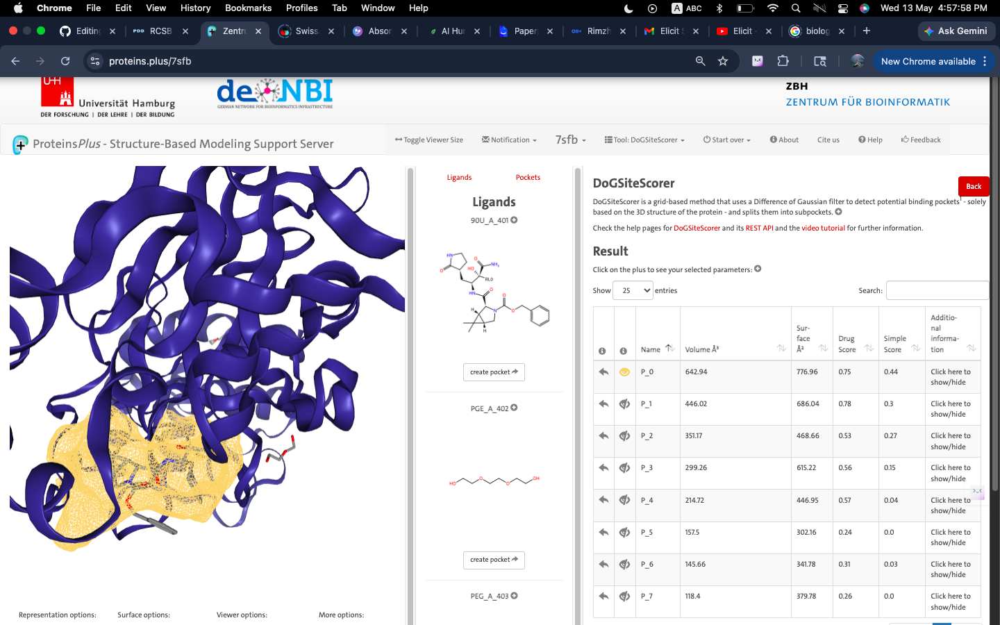
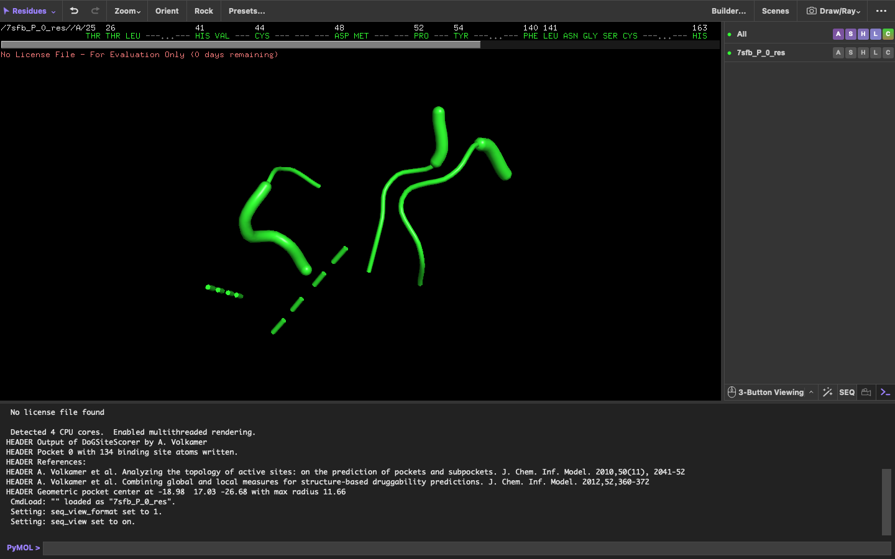

# Binding site prediction 

## Tools used 
I used DoGSiteScorer to find possible binding pockets in the 7SFB protein structure.

---

## Selected Binding Pocket
I chose the pocket P_0 for further analysis because it overlapped with the region containing the co-crystallized ligand.
The 7SFB crystal structure contains the co-crystallized inhibitor 90U (ML101) along with additional hetero residues such as PEG and PGE. During binding site analysis, the predicted pocket P_0 showed strong overlap with the region occupied by the co-crystallized ligand, supporting its selection as the primary docking region for further analysis.
|Pocket ID | Volume (ų) | Surface Area (Ų) | Drug Score | Simple Score |
|---|---|---|---|---|
| **P_0** |  642.94 | 776.96 | **0.75** | 0.44 |
| **P_1** | 446.02 | 686.04 | **0.78** | 0.3|
 
---
## Observations
I observed that the predicted binding pocket overlapped closely with the co-crystallised ligand region.

Most of the co-crystallized ligand appeared buried within the pocket, with only a smaller part still exposed on the protein surface.

The binding cavity appeared moderately deep and suitable for docking-based analysis.

---

## Interpretation
Although there is another predicted binding pocket that showed a slightly higher drug score of 0.78, I selected P_0 because its location corresponded with the experimentally observed ligand-binding region.

This overlap supported the selection of P_0 as the primary docking site for further molecular docking studies.

----

## Binding Site Residues

The following residues were identified around the predicted binding pocket:

THR25, THR26, LEU27, HIS41, VAL42, CYS44, ASP48, MET49, PRO52, TYR54, PHE140, LEU141, ASN142, GLY143, SER144, CYS145, HIS163, HIS164, MET165, GLU166, LEU167, PRO168, HIS172, VAL186, ASP187, ARG188, GLN189, THR190, ALA191 and GLN192.

These residues helped identify the active-site region and provided a clearer understanding of where ligand interactions were most likely to occur during docking analysis.

---

## Visualization

### Predicted Binding Pocket

### Pocket and Co-crystallized Ligand Overlap

 ### Binding Site Residues Visualized in PyMOL

---

## Validation Approach

I used DoGSiteScorer to predict likely ligand-binding pockets by looking at the shape and geometry of the protein surface.

Then I checked the predicted pocket in PyMOL to make sure it overlapped with the co-crystallized ligand region and to spot the key residues around the active-site area.

