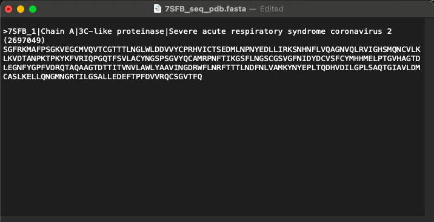
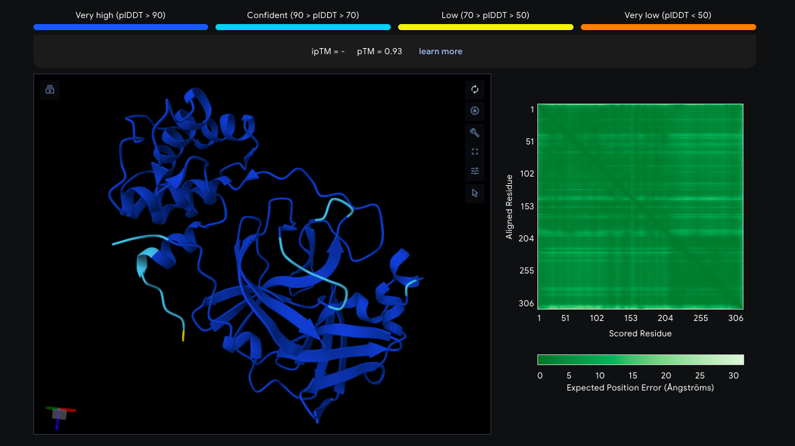

# Protein Structure Prediction Using AlphaFold

## Overview

In this part of the project, I used the AlphaFold Server to predict the protein structure and then compared that prediction with the experimentally determined structure of the SARS-CoV-2 main protease (PDB ID: 7SFB).

---

## FASTA Sequence

I first retrieved the protein’s amino acid FASTA sequence and used it as the input for the AlphaFold prediction.

### FASTA Sequence Preview

---

## AlphaFold Structure Prediction

I submitted the FASTA sequence to the AlphaFold Server to generate a structure prediction.

The model returned high confidence for most parts of the protein, while a few more flexible sections showed lower confidence.

### Predicted Structure

---

## Structural Alignment with Experimental Structure

To see how close the prediction was to the real structure, I aligned the AlphaFold model with the prepared experimental 7SFB structure in PyMOL and checked their overall similarity.

The two structures aligned closely.

### Alignment Result

- RMSD: 0.697 Å

### Structure Alignment

---

## Conclusion

Doing this comparison helped me get a clearer sense of how predicted protein structures can be lined up with experimentally solved structures as part of a typical computational structural biology workflow.
